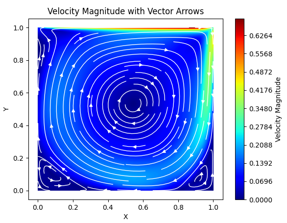

# 2-D-Lid-Driven-Cavity
This is a SIMPLE scheme for the popular lid-driven cavity problem in 2-D.

There are two versions of the script: one version is pure python and the other version had the Gauss Seidel function implemented in C for better peformance, as this was the slowest function. For example, on a 100x100 grid, the pure Python script finishes 100 iterations in 175 seconds, while SIMPLE with C finishes 1000 iterations in 10.8 seconds and 100 iterations in 1.2 seconds, making it 14600% faster.

The scripts should have sufficient comments so that anyone familar with this problem can follow along.

For the SIMPLE scheme, it uses the discretize momentum equations using the finite volume method (FVM) with upwind difference scheme for the convective term, central difference for the diffusion term, and linear interpolation for the pressure gradient term. for the linear equation solver, it uses Gauss Seidel. One thing to not is that there is no convergence check for the SIMPLE with, so choose your parameters carefully to make sure it doesn't run for too long. Both codes also include Rhie and Chow Correction to prevent checkerboard patterning.

The image below is a 100x100 grid with Re = 10,000 by making mu = 0.0001

